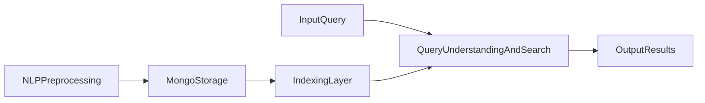

# Travel IR System

## Tổng quan

`travel_ir_system` là hệ thống truy hồi thông tin khách sạn cho truy vấn tiếng Việt tự nhiên. Mục tiêu của hệ thống là nhận một câu hỏi của người dùng, chuẩn hóa và hiểu ý định truy vấn, sau đó tìm ra các khách sạn phù hợp nhất dựa trên dữ liệu review đã được xử lý trước.

README này chỉ tập trung vào các chức năng IR đang có trong hệ thống, bỏ qua phần crawl dữ liệu.

## Mô hình tổng quát

Hệ thống hiện vận hành theo các khung xử lý chính sau:

1. Tiền xử lý ngôn ngữ tự nhiên và chuẩn hóa dữ liệu
2. Lưu trữ dữ liệu vào MongoDB
3. Tạo chỉ mục phục vụ truy hồi
4. Xử lý truy vấn và tìm kiếm
5. Trình bày kết quả đầu ra

Luồng tổng quát:



## Input và Output

### Input của hệ thống

Hệ thống nhận hai loại input chính:

- Input dữ liệu:
  - `data/raw/traveloka_raw_final.json`
  - `data/raw/traveloka_checkpoint.jsonl`
  - hoặc dataset ngoài qua `dataset_pipeline.py`
- Input truy vấn:
  - một câu tiếng Việt tự nhiên, ví dụ:
    - `tôi muốn tìm khách sạn view biển đẹp ở phú quốc`
    - `resort có hồ bơi và ăn sáng ngon ở đà nẵng`

### Hệ thống xử lý input như thế nào

- Với input dữ liệu, hệ thống không đưa thẳng vào search engine mà phải đi qua bước làm sạch, chuẩn hóa và lưu trữ.
- Với input truy vấn, hệ thống không coi đó là một chuỗi ký tự thô mà sẽ bóc tách thành:
  - token cốt lõi
  - location
  - descriptor
  - synonym mở rộng
  - category gợi ý cho retrieval

### Vì sao phải tách rõ input như vậy

- Dữ liệu review và câu truy vấn có bản chất khác nhau: review là nguồn tri thức, còn query là tín hiệu tìm kiếm.
- Nếu đưa cả hai vào hệ thống mà không chuẩn hóa, các bước matching phía sau sẽ rất nhiễu.
- Việc tách input theo đúng vai trò giúp hệ thống kiểm soát rõ: cái gì dùng để lập chỉ mục và cái gì dùng để truy hồi.

### Output của hệ thống

Output cuối cùng là danh sách khách sạn đã được xếp hạng, thường gồm:

- tên khách sạn
- địa điểm
- điểm xếp hạng hybrid
- điểm thành phần BM25 và vector
- cờ khớp location
- các review nổi bật liên quan nhất

Trong giao diện `app_gui.py`, output được hiển thị ở mức hotel-level thay vì chỉ trả về từng review rời rạc.

### Hệ thống tạo output như thế nào

- Hệ thống chấm điểm ở mức review trước.
- Các review liên quan nhất sẽ được gom lại theo `source_hotel_id`.
- Sau đó hệ thống tính điểm khách sạn dựa trên các review tốt nhất của cùng khách sạn.
- Kết quả cuối cùng mới được đưa ra ở mức hotel-level để người dùng dễ đọc và dễ ra quyết định.

### Vì sao output không trả thẳng từng review

- Người dùng cần chọn khách sạn, không cần một danh sách review rời rạc.
- Nếu chỉ trả về review-level, kết quả sẽ bị lặp nhiều review của cùng một khách sạn.
- Hotel-level output giúp kết quả gọn hơn, đúng bài toán hơn và phù hợp cho GUI.

## Khung 1: Tiền xử lý ngôn ngữ tự nhiên

Khung này có nhiệm vụ làm sạch review và chuẩn hóa dữ liệu để các bước indexing và retrieval dùng được.

### Thành phần chính

- `main.py`
- `dataset_pipeline.py`
- `preprocessing/clean_text.py`
- `preprocessing/language_filter.py`
- `preprocessing/remove_spam.py`
- `nlp/normalization.py`
- `nlp/tokenizer.py`
- `nlp/stopwords.py`

### Luồng xử lý

Với mỗi review, hệ thống thực hiện:

1. Làm sạch văn bản
2. Loại bỏ review spam hoặc quá kém chất lượng
3. Lọc review tiếng Việt
4. Chuẩn hóa văn bản
5. Tách từ
6. Loại stopwords
7. Sinh ra `clean_text` và `tokens`

### Cách khung NLP thực hiện

- `preprocessing/clean_text.py` xử lý nhiễu bề mặt như khoảng trắng dư, ký tự không cần thiết và text bẩn.
- `preprocessing/remove_spam.py` loại bớt các review có dấu hiệu spam, lặp vô nghĩa hoặc quá ít giá trị.
- `preprocessing/language_filter.py` giữ lại review tiếng Việt để đồng nhất ngôn ngữ cho toàn bộ chỉ mục.
- `nlp/normalization.py` đưa văn bản về dạng ổn định hơn để các bước sau không bị lệch do khác biệt viết hoa, dấu câu hoặc cách trình bày.
- `nlp/tokenizer.py` tách từ tiếng Việt để tạo đơn vị xử lý cho BM25 và query understanding.
- `nlp/stopwords.py` loại những từ ít giá trị phân biệt như các từ hư hoặc từ quá phổ biến.

### Vì sao phải làm theo chuỗi này

- Làm sạch trước giúp tránh việc tokenizer và index phải xử lý cả dữ liệu nhiễu.
- Lọc spam và lọc ngôn ngữ giúp tránh làm loãng chỉ mục bằng những review không hữu ích.
- Chuẩn hóa trước khi tokenize giúp cùng một ý nghĩa không bị chia thành nhiều dạng biểu diễn khác nhau.
- Tokenize và stopword removal là điều kiện gần như bắt buộc để BM25 hoạt động ổn định trên tiếng Việt.
- Kết quả cuối của khung này là biến text thô thành dạng dữ liệu có thể truy hồi được.

### Hai pipeline dữ liệu hiện có

#### 1. Pipeline nội bộ từ dữ liệu raw

`main.py` đọc dữ liệu từ file raw nội bộ, xử lý NLP và ghi ra:

- `data/processed/reviews_processed.json`

Nếu chạy với `--load-mongo`, hệ thống sẽ nạp dữ liệu đã xử lý vào MongoDB.

Pipeline này phù hợp khi dữ liệu đã ở gần schema chuẩn của hệ thống.

#### 2. Pipeline hợp nhất dataset ngoài

`dataset_pipeline.py` dùng khi có dữ liệu từ nhiều nguồn khác nhau. File này làm các việc:

- đọc cấu hình nguồn từ `config/dataset_sources.yaml`
- map các trường từ nguồn ngoài về schema chung
- chuẩn hóa `review_id`, `source_hotel_id`, `hotel_name`, `location`
- chạy lại cùng pipeline NLP như dữ liệu nội bộ

Pipeline này tồn tại vì dữ liệu ngoài thường không cùng cấu trúc với dữ liệu nội bộ. Nếu không map về schema chung từ đầu, toàn bộ các bước lưu trữ, indexing và retrieval phía sau sẽ bị lệch.

Khung này là nền móng của toàn bộ hệ thống. Nếu dữ liệu sau bước này không sạch, các bước phía sau sẽ sai theo.

## Khung 2: Lưu trữ dữ liệu

Khung lưu trữ hiện dùng MongoDB và được tổ chức chủ yếu qua:

- `database/mongo_connection.py`
- `database/data_loader.py`

### Hai collection chính

#### `places`

Lưu thông tin mức khách sạn:

- `source_hotel_id`
- `name`
- `location`
- `rating`
- `source`

#### `reviews`

Lưu thông tin mức review:

- `review_id`
- `source_review_id`
- `source_hotel_id`
- `review_text`
- `clean_text`
- `tokens`
- `review_rating`
- `source`

### Điểm thiết kế quan trọng

`data_loader.py` cố tình không giữ lặp `hotel_name`, `location`, `rating` trong từng review để tránh dư thừa. Vì vậy:

- thông tin mức khách sạn nằm ở `places`
- thông tin mức review nằm ở `reviews`

Đây là điểm rất quan trọng vì các bước build index phải join hai collection này lại với nhau.

### Cách khung lưu trữ thực hiện

- `database/mongo_connection.py` đọc cấu hình trong `config/config.yaml` để kết nối MongoDB.
- `database/data_loader.py` đi qua từng record đã xử lý:
  - upsert khách sạn vào `places`
  - upsert review vào `reviews`
- Khóa nhận diện review là `review_id`.
- Khóa nhận diện khách sạn được xây theo nguồn và `source_hotel_id`.

### Vì sao phải tách `places` và `reviews`

- Thông tin khách sạn như tên, địa điểm, rating không nên lặp lại ở mọi review.
- Review cần nhẹ hơn để việc lưu trữ và truy vấn nhanh hơn.
- Tách hai mức dữ liệu giúp build index linh hoạt: có thể lấy nội dung review nhưng vẫn kéo thêm metadata khách sạn khi cần.
- Đây cũng là lý do các script indexing đều phải join từ `places` sang `reviews`, chứ không thể chỉ đọc một collection duy nhất.

## Khung 3: Indexing

Hệ thống hiện có 2 loại chỉ mục chính:

- BM25 index
- Vector index

### 1. BM25 indexing

File chính:

- `indexing/build_bm25_index.py`

Đặc điểm:

- chỉ mục được xây ở mức review-level
- mỗi review được bổ sung thêm thông tin `hotel_name` và `location` từ collection `places`
- token của tài liệu được gán trọng số theo field:
  - `hotel_name`: trọng số cao hơn
  - `location`: trọng số trung bình
  - `review_text/tokens`: trọng số nền

Mục tiêu của BM25 là tăng khả năng match theo từ khóa trực tiếp.

#### BM25 được build như thế nào

- Script lấy các review đã có `tokens` từ MongoDB.
- Mỗi review được bổ sung thêm `hotel_name` và `location` lấy từ collection `places`.
- Hệ thống tạo document review-level với field weighting:
  - token từ tên khách sạn được nhân trọng số cao hơn
  - token từ địa điểm được nhân trọng số trung bình
  - token từ nội dung review giữ trọng số nền
- Sau đó mới tạo `BM25Okapi` và lưu ra file index.

#### Vì sao BM25 cần weighting theo field

- Tên khách sạn và địa điểm thường là tín hiệu mạnh hơn so với một từ bất kỳ trong review.
- Nếu không weighting, từ khóa location hoặc tên nơi lưu trú có thể bị chìm giữa quá nhiều token nội dung.
- Cách làm này giúp BM25 phản ứng tốt hơn với các truy vấn có tín hiệu rõ như địa danh, loại hình khách sạn hoặc tên riêng.

### 2. Vector indexing

File chính:

- `indexing/build_vector_index.py`

Đặc điểm:

- cũng build ở mức review-level
- mỗi document được ghép từ:
  - `hotel_name`
  - `location`
  - `clean_text`
- hệ thống dùng mô hình:
  - `sentence-transformers/paraphrase-multilingual-MiniLM-L12-v2`

Mục tiêu của vector index là tăng khả năng match theo ngữ nghĩa, không phụ thuộc hoàn toàn vào việc trùng từ khóa.

#### Vector index được build như thế nào

- Mỗi review-level document được chuyển thành một chuỗi biểu diễn giàu ngữ cảnh hơn bằng cách ghép:
  - tên khách sạn
  - địa điểm
  - nội dung review đã làm sạch
- Hệ thống dùng `sentence-transformers/paraphrase-multilingual-MiniLM-L12-v2` để encode toàn bộ documents thành dense vectors.
- Các embeddings và metadata documents được lưu lại trong `vector_index.pkl`.

#### Vì sao vector index phải ghép thêm `hotel_name` và `location`

- Nếu chỉ encode riêng review text, mô hình có thể hiểu ý nghĩa cảm xúc nhưng thiếu bối cảnh địa điểm và loại nơi lưu trú.
- Ghép thêm metadata giúp truy vấn như `view biển phú quốc` gần hơn với các review đúng khách sạn đúng khu vực.
- Đây là cách bù lại điểm yếu của semantic search khi dữ liệu review thuần túy không nhắc đủ metadata.

### Kết quả của indexing

Sau khi build, hệ thống tạo:

- `data/index/bm25_index.pkl`
- `data/index/vector_index.pkl`

Đây là đầu vào trực tiếp cho search engine.

## Khung 4: Xử lý truy vấn và tìm kiếm

Đây là lõi của hệ thống IR hiện tại.

### Thành phần chính của truy hồi

- `retrieval/query_understanding.py`
- `retrieval/query_processing.py`
- `retrieval/search_engine.py`

### 1. Query understanding

`query_understanding.py` xử lý truy vấn ở mức ngữ nghĩa, bao gồm:

1. chuẩn hóa câu truy vấn
2. tokenize
3. loại stopwords chung
4. loại query stopwords như `tôi`, `muốn`, `tìm`, `giúp`, `ở`
5. phát hiện location
6. trích descriptor tokens
7. mở rộng truy vấn bằng synonym
8. suy ra category phục vụ lọc candidate

Ví dụ, từ một truy vấn như:

`tôi muốn tìm khách sạn view biển đẹp ở phú quốc`

hệ thống có thể tách ra:

- location: `phú_quốc`
- descriptor: `view`, `biển`, `đẹp`
- expanded tokens từ các từ đồng nghĩa liên quan

#### Query understanding thực hiện như thế nào

- `normalize_text()` chuẩn hóa câu hỏi.
- `tokenize_vi()` tách truy vấn thành token.
- Hệ thống loại hai lớp stopwords:
  - stopwords chung của ngôn ngữ
  - query stopwords như `tôi`, `muốn`, `tìm`, `giúp`
- Sau đó hệ thống cố gắng nhận diện địa điểm theo:
  - trigram
  - bigram
  - alias/unigram
- Từ các token còn lại, hệ thống trích ra descriptor tokens.
- Cuối cùng, hệ thống mở rộng truy vấn bằng synonym và suy ra category để phục vụ lọc candidate.

#### Vì sao query understanding là bắt buộc

- Người dùng không nhập từ khóa kiểu máy, mà nhập câu tự nhiên có nhiều từ dư.
- Nếu không bỏ query stopwords, các từ như `muốn`, `tìm`, `giúp` sẽ làm nhiễu retrieval.
- Nếu không detect location, hệ thống dễ trả về khách sạn đúng descriptor nhưng sai vùng.
- Nếu không expand synonym, truy vấn và review có thể cùng nghĩa nhưng không trùng bề mặt từ vựng.

### 2. Search engine

`retrieval/search_engine.py` là nơi thực hiện xếp hạng.

Hệ thống hiện đang chạy theo hướng hybrid:

- BM25 score cho mức độ khớp từ khóa
- Vector score cho mức độ khớp ngữ nghĩa
- lọc candidate theo location/category
- location boosting
- penalty nếu descriptor không được review support đủ
- gom từ review-level lên hotel-level

#### Search engine thực hiện như thế nào

Luồng chính trong `search_hybrid()` hiện tại là:

1. Gọi `understand_query()` để lấy cấu trúc truy vấn.
2. Nạp đồng thời `bm25_index.pkl` và `vector_index.pkl`.
3. Tạo candidate mask theo location và category nếu truy vấn có tín hiệu rõ.
4. Tính điểm BM25 trên tập token mở rộng.
5. Tính điểm vector bằng embedding của câu truy vấn.
6. Chuẩn hóa hai loại điểm.
7. Trộn điểm theo trọng số `vector_weight` và `bm25_weight`.
8. Gom các review điểm cao theo `source_hotel_id`.
9. Áp dụng thêm các luật tăng giảm điểm:
   - descriptor support
   - POI/category matching
   - location boosting
   - accommodation type boosting
10. Trả ra ranking cuối cùng ở mức khách sạn.

#### Vì sao phải dùng hybrid ranking thay vì một mô hình duy nhất

- BM25 mạnh khi người dùng dùng từ khóa rất rõ và review cũng chứa đúng từ đó.
- Vector mạnh khi người dùng dùng câu tự nhiên hoặc diễn đạt khác với review.
- Candidate filtering giúp giảm nhiễu khi truy vấn có location hoặc category rõ ràng.
- Boost và penalty giúp biến điểm số từ “khớp thống kê” thành “khớp đúng nhu cầu người dùng” hơn.
- Đây là lý do hệ thống hiện không chỉ là search lexical đơn giản mà là một pipeline IR có tầng hiểu truy vấn và xếp hạng nhiều bước.

### Tại sao lại gom từ review-level lên hotel-level

Chỉ mục được xây ở mức review vì review là đơn vị chứa ngữ nghĩa cụ thể nhất. Nhưng người dùng không cần một review, mà cần một khách sạn. Vì vậy hệ thống:

1. chấm điểm ở mức review
2. lấy các review tốt nhất của cùng một khách sạn
3. tổng hợp lại thành điểm hotel-level
4. trả về top khách sạn

Đây là điểm thiết kế quan trọng nhất của mô hình hiện tại.

Nếu không có bước gom này, một khách sạn có nhiều review tốt sẽ chiếm nhiều dòng kết quả và làm trải nghiệm tìm kiếm kém trực quan.

## Khung 5: Tóm tắt review

Khung này nằm trong:

- `summarization/__init__.py`

Hệ thống hiện có hàm `summarize_reviews_tfidf()` để tạo tóm tắt extractive từ nhiều review bằng TF-IDF và cosine similarity.

Luồng của module này:

1. tách review thành các câu
2. vector hóa các câu bằng TF-IDF
3. tính độ quan trọng của từng câu qua similarity
4. chọn ra các câu đại diện nhất

### Cách khung tóm tắt hoạt động

- Mỗi review được tách thành các câu ngắn.
- Tất cả câu được biểu diễn bằng TF-IDF.
- Hệ thống tính similarity giữa các câu để tìm câu nào đại diện nhất cho tập review.
- Những câu điểm cao nhất sẽ được ghép lại thành phần tóm tắt ngắn.

### Vì sao chọn extractive summarization

- Dễ kiểm soát vì câu tóm tắt luôn lấy từ review thật, ít nguy cơ bịa nội dung.
- Phù hợp với phạm vi hiện tại khi hệ thống đang tập trung vào IR hơn là sinh ngôn ngữ.
- Có thể dùng như lớp hỗ trợ đọc nhanh kết quả mà không làm phức tạp retrieval pipeline.

### Lưu ý quan trọng

Phần summarization hiện đã có module riêng, nhưng cần giới thiệu đúng mức:

- đây là chức năng hỗ trợ
- không phải lõi xếp hạng chính
- nên mô tả là baseline extractive summarization

## Khung 6: Giao diện đầu vào và đầu ra

File chính:

- `app_gui.py`

Đây là lớp trình diễn trực tiếp của hệ thống.

### Chức năng GUI hiện có

- nhập truy vấn tiếng Việt tự nhiên
- chọn query mẫu
- điều chỉnh trọng số:
  - vector weight
  - BM25 weight
  - location boost
- hiển thị phần query understanding
- hiển thị top khách sạn
- hiển thị top review liên quan nhất

### GUI hoạt động như thế nào

- Người dùng nhập truy vấn hoặc chọn query mẫu.
- GUI chuyển truy vấn cùng các tham số trọng số vào `search_hybrid()`.
- Sau khi search hoàn tất, GUI hiển thị:
  - thông tin query understanding
  - top khách sạn
  - điểm hybrid, BM25, vector
  - top reviews liên quan

### Vì sao GUI cần hiển thị cả phần giải thích truy vấn

- Đây là cách giúp người dùng và người review hệ thống hiểu model đang “bắt” được gì từ câu truy vấn.
- Nếu kết quả sai, phần query understanding giúp soi xem lỗi nằm ở detect location, descriptor hay ranking.
- GUI vì thế không chỉ là nơi hiển thị kết quả, mà còn là công cụ quan sát hành vi của hệ IR.

### Vai trò của GUI

GUI không phải là mô hình IR, mà là nơi thể hiện kết quả hoạt động của:

- query understanding
- hybrid retrieval
- hotel ranking

Vì vậy khi giới thiệu hệ thống, GUI nên được nói sau khi đã giải thích rõ pipeline retrieval.

## Cách chạy các chức năng chính

### 1. Xử lý dữ liệu và nạp MongoDB

```bash
cd /Users/thantrong/Code_TH/THTT/DOAN/travel_ir_system
python main.py --load-mongo
```

### 2. Build BM25 index

```bash
python indexing/build_bm25_index.py
```

### 3. Build Vector index

```bash
python indexing/build_vector_index.py
```

### 4. Chạy GUI

```bash
streamlit run app_gui.py
```

### 5. Chạy pipeline end-to-end RAG (crawl → làm sạch → index → kiểm tra RAG)

```bash
python scripts/run_end_to_end_rag.py --skip-crawl --skip-hotel-clean
```

Gợi ý:

- Bỏ `--skip-crawl` nếu muốn crawl mới từ Traveloka.
- Bỏ `--skip-hotel-clean` nếu muốn xử lý lại dữ liệu HTML chi tiết khách sạn.
- Script sẽ chạy smoke test RAG ở cuối để đảm bảo pipeline không văng lỗi.

## Những gì hệ thống đã làm được

Tính đến hiện tại, phần IR của hệ thống đã có:

- pipeline làm sạch và chuẩn hóa review tiếng Việt
- chuẩn hóa dữ liệu từ nhiều nguồn về cùng schema
- lưu trữ MongoDB tách mức khách sạn và mức review
- BM25 indexing
- vector indexing bằng multilingual sentence transformer
- query understanding cho truy vấn tiếng Việt tự nhiên
- hybrid retrieval có location boosting và gom review lên hotel-level
- GUI Streamlit để demo và thao tác trực tiếp

## Những điểm cần giới thiệu đúng, không nói quá

- Hệ thống mạnh ở phần truy hồi và tổ chức pipeline IR, không phải ở phần sinh ngôn ngữ.
- Summarization hiện là extractive baseline, chưa phải tóm tắt sinh tự nhiên.
- Chất lượng query understanding phụ thuộc khá nhiều vào bộ từ khóa, synonym và luật nhận diện location.
- Chất lượng retrieval phụ thuộc trực tiếp vào chất lượng dữ liệu đã qua bước preprocessing.

## Cơ chế kiểm soát nội dung tiêu cực

Hệ thống tích hợp nhiều lớp lọc để đảm bảo kết quả tìm kiếm phản ánh đúng ý định người dùng và hạn chế đưa review mang cảm xúc xấu lên cao.

### Các lớp lọc trong pipeline

| Lớp lọc | Vị trí | Trạng thái | Mô tả |
|---------|--------|-----------|-------|
| **Spam Filter** | `preprocessing/remove_spam.py` | Bật | Loại review quá ngắn, lặp ký tự, chứa từ quảng cáo |
| **Candidate Mask** | `search_engine.py` | Bật | Lọc candidate theo location + category |
| **Negative Tag Filter** | `search_engine.py` | Tắt (hard filter) | Loại review có tag tiêu cực khi query quan tâm khía cạnh đó |
| **Sentiment Penalty** | `search_engine.py` | Bật (soft filter) | Giảm điểm review chứa từ tiêu cực |
| **Indexing Tag Filter** | `indexing/build_*_index.py` | Bật | Lọc tag tiêu cực khi build index |

### Sentiment Penalty

Khi review chứa từ tiêu cực, hệ thống không loại bỏ hoàn toàn mà áp dụng hệ số phạt vào score:

- **Từ tiêu cực mạnh**: "rất tệ", "tồi tệ", "thất vọng", "bẩn", "dơ", "ồn", "không sạch"...
- **Từ tiêu cực nhẹ**: "hơi nhỏ", "hơi cũ", "hơi ồn", "chưa tốt", "không ổn"...

Hệ số phạt phụ thuộc vào số lượng từ tiêu cực và có xung đột với intent query hay không:

- Xung đột detected + nhiều từ mạnh → phạt nặng hơn (×0.70)
- Không xung đột + ít từ tiêu cực → phạt nhẹ (×0.95)
- Không có từ tiêu cực → không phạt (×1.00)

### Lọc tag tiêu cực khi Indexing

Khi build BM25 và Vector index, hệ thống tự động loại các tag mang ý nghĩa tiêu cực khỏi corpus:

- **Tiền tố phủ định**: `!`, `not_`, `no_`, `non_`, `bad_`, `poor_`, `worst_`
- **Từ tiêu cực tiếng Việt**: "tệ", "tồi_tệ", "bẩn", "dơ", "ồn", "thất_vọng", "không_đáng_tiền"...

Việc lọc ở giai đoạn indexing giúp embedding và BM25 scores không bị ảnh hưởng bởi nội dung tiêu cực, thay vì phải xử lý lúc runtime.

## Hệ thống đánh giá (Evaluation)

### Test Queries Bucketed

Hệ thống có bộ 200 truy vấn đánh giá được chia thành 5 buckets để kiểm tra các khía cạnh khác nhau:

| Bucket | Tên | Số queries | Mục đích |
|--------|-----|-----------|----------|
| 1 | `short_1_2_attributes` | 40 | Truy vấn ngắn, 1-2 thuộc tính |
| 2 | `long_context_rich` | 40 | Truy vấn dài, nhiều ràng buộc |
| 3 | `geo_diverse_priority_minor_provinces` | 40 | Đa dạng địa lý, ưu tiên tỉnh lẻ |
| 4 | `natural_language_semantic_queries` | 40 | Chỉ location, kiểm tra semantic |
| 5 | `random_mix_robustness` | 40 | Hỗn hợp, kiểm tra độ bền vững |

File: `data/evaluation/test_queries_200_bucketed.json`

### Pool-based Evaluation

Hệ thống hỗ trợ đánh giá pool-based với các file:
- `pool_results.json` / `pool_results.csv` — kết quả pool
- `pool_results_labeled.csv` — kết quả đã gán nhãn
- `evaluate_pool_results.py` — script đánh giá

## Thứ tự nên dùng khi thuyết trình hoặc viết báo cáo

1. Giới thiệu mục tiêu bài toán
2. Trình bày bức tranh tổng quát của mô hình IR
3. Nêu input và output
4. Đi sâu vào từng khung:
   - NLP preprocessing
   - Mongo storage
   - Indexing
   - Query understanding và retrieval
   - Summarization
   - GUI
5. Kết thúc bằng các điểm mạnh, hạn chế và hướng mở rộng
